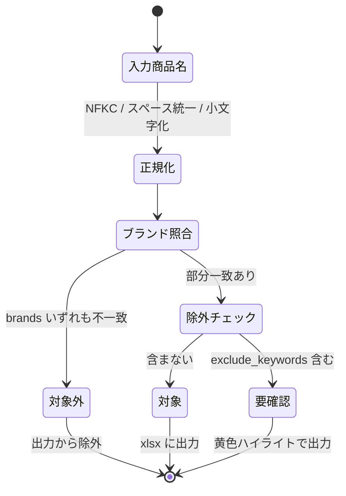
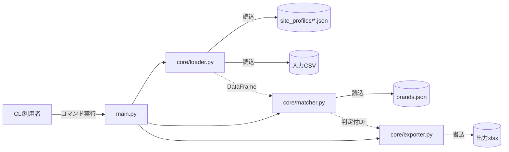

<p align="center">
  
</p>

<h3 align="center">セルフメディケーション税制 明細抽出ツール</h3>

<p align="center">
  通販サイトの購入履歴CSVから、確定申告に必要な<strong>対象医薬品だけ</strong>をExcelに抽出。<br/>
  完全オフライン動作 &mdash; あなたの購入データは一切外部に送信されません。
</p>

<p align="center">
  <a href="#クイックスタート">クイックスタート</a>&nbsp;&nbsp;|&nbsp;&nbsp;
  <a href="#対応通販サイト">対応サイト</a>&nbsp;&nbsp;|&nbsp;&nbsp;
  <a href="#カスタマイズ">カスタマイズ</a>&nbsp;&nbsp;|&nbsp;&nbsp;
  <a href="https://github.com/highdefinitionaudiodriver/selfmed-tax-tool/releases">Releases (EXE)</a>
</p>

<p align="center">
  
  
  
  
  
  
</p>

---

## 目次

- [概要](#概要)
- [クイックスタート](#クイックスタート)
- [デモ](#デモ)
- [対応通販サイト](#対応通販サイト)
- [インストール](#インストール)
- [使い方](#使い方)
- [各サイトのCSV取得方法](#各サイトのcsv取得方法)
- [カスタマイズ](#カスタマイズ)
- [判定ロジック](#判定ロジック)
- [アーキテクチャ](#アーキテクチャ)
- [テスト](#テスト)
- [セキュリティとプライバシー](#セキュリティとプライバシー)
- [ロードマップ](#ロードマップ)
- [Contributing](#contributing)
- [ライセンス](#ライセンス)

---

## 概要

**Selfmed Tax Tool** は、国内主要通販サイトの購入履歴CSVから **セルフメディケーション税制の対象となるOTC医薬品** のみを自動抽出し、確定申告の明細書に転記しやすい Excel（xlsx）形式で出力する CLI ツールです。

### なぜこのツールが必要か

- Amazon や楽天で日用品と一緒に買った市販薬を、年末に手作業で仕分けるのは現実的ではない
- セルフメディケーション税制は **年間12,000円を超えた分** が所得控除の対象だが、対象品の把握が面倒で申告を諦める人が多い
- このツールを使えば **CSVを1つ用意するだけ** で、対象品の一覧と合計金額が即座にわかる

### 特徴

| | |
|---|---|
| **完全ローカル処理** | 購入履歴を外部APIに一切送信しない。LLMへの丸投げもゼロ |
| **国内13サイト対応** | Amazon / 楽天 / Yahoo! / LOHACO / ヨドバシ / マツキヨ / ウエルシア 他 |
| **3段階判定** | `対象` / `要確認` / `対象外` で自動分類。Human-in-the-loop 前提の安全設計 |
| **設定ファイル駆動** | ブランド辞書もカラムマッピングもJSON。コード変更なしで新薬・新サイトに対応 |
| **確定申告向け出力** | 国税庁の明細書フォーマットに合わせた xlsx（要確認行は黄色ハイライト） |

---

## クイックスタート

```bash
# 1. クローン & セットアップ
git clone https://github.com/highdefinitionaudiodriver/selfmed-tax-tool.git
cd selfmed-tax-tool
pip install -r requirements.txt

# 2. 実行（Amazon CSVの例）
python main.py --input 注文履歴.csv --year 2025

# 3. selfmed_result.xlsx が生成される
```

> **Windows EXE 版**: Python 不要で使えるスタンドアロン実行ファイルを [Releases](https://github.com/highdefinitionaudiodriver/selfmed-tax-tool/releases) で配布しています。

---

## デモ

### 実行結果

```
$ python main.py --input amazon_2025.csv --year 2025

読み込み中: amazon_2025.csv
  → 128 件の注文を読み込みました
  → 2025年の注文: 89 件
  → 対象: 12 件 / 要確認: 2 件

出力完了: selfmed_result.xlsx
合計金額: 15,240円

※ 「要確認」が 2 件あります。出力ファイルの黄色行を確認してください。
```

### 出力イメージ（xlsx）

```
┌──────────────┬──────────────────────┬──────────┬────────────┬────────┐
│ 支払先の名称  │ 医薬品の名称          │支払った   │ 購入日      │ 判定   │
│              │                      │ 金額     │            │        │
├──────────────┼──────────────────────┼──────────┼────────────┼────────┤
│ Amazon       │ ロキソニンS 12錠      │      698 │ 2025-03-15 │ 対象   │
│ 楽天市場      │ パブロンゴールドA 44錠│    1,280 │ 2025-06-02 │ 対象   │
│ LOHACO       │ アレグラFX 28錠       │    1,980 │ 2025-09-01 │ 対象   │
│ マツモトキヨシ│ バファリンEXルナ 20錠 │      980 │ 2025-11-10 │ 要確認 │ ← 黄色
│ Amazon       │ チョコラBBプラス 60錠 │    1,580 │ 2025-11-05 │ 対象   │
├──────────────┼──────────────────────┼──────────┼────────────┼────────┤
│              │                合計  │    6,518 │            │        │
└──────────────┴──────────────────────┴──────────┴────────────┴────────┘
```

---

## 対応通販サイト

`--site` オプションで切り替えます。対応一覧は `python main.py --list-sites` でも確認可能。

### 総合通販

| `--site` キー | サイト名 | 備考 |
|---|---|---|
| `amazon` | Amazon.co.jp | Chrome拡張「Amazon注文履歴フィルタ」等でCSV取得 |
| `rakuten` | 楽天市場 | 注文履歴ダウンロード機能 |
| `yahoo_shopping` | Yahoo!ショッピング | 旧PayPayモール含む |
| `lohaco` | LOHACO (ASKUL) | OTC医薬品の品揃えが豊富 |
| `aupay_market` | au PAY マーケット | 旧Wowma |
| `yodobashi` | ヨドバシ.com | 医薬品カテゴリあり |
| `qoo10` | Qoo10 | |

### ドラッグストアEC

| `--site` キー | サイト名 | 備考 |
|---|---|---|
| `matsukiyo` | マツモトキヨシ | マツキヨオンラインストア |
| `welcia` | ウエルシア | ウエルシアドットコム |
| `sundrug` | サンドラッグ | サンドラッグe-shop |
| `tsuruha` | ツルハドラッグ | ツルハグループe-shop |
| `kokokara` | ココカラファイン | ココカラクラブ |
| `sugi` | スギ薬局 | スギ薬局オンラインショップ |

> **Note**
> 各サイトのカラム名はデフォルト値です。実際のCSVと異なる場合は `config/site_profiles/<キー>.json` を編集してください。

---

## インストール

### 方法 1: ソースから（推奨）

```bash
git clone https://github.com/highdefinitionaudiodriver/selfmed-tax-tool.git
cd selfmed-tax-tool
pip install -r requirements.txt
```

依存は **2つだけ**:

| パッケージ | 用途 | ネットワーク |
|---|---|---|
| `pandas` | CSV読み込み・データ加工 | 不要 |
| `openpyxl` | xlsx出力・書式設定 | 不要 |

### 方法 2: Windows EXE（Pythonインストール不要）

[Releases](https://github.com/highdefinitionaudiodriver/selfmed-tax-tool/releases) から `SelfmedTaxTool-vX.X.X.zip` をダウンロードして展開するだけ。

```
SelfmedTaxTool.exe          ← 実行ファイル
config/                     ← 設定（編集可能）
SelfmedTaxTool説明書.txt     ← マニュアル
```

---

## 使い方

### 基本

```bash
python main.py --input 注文履歴.csv
```

### サイト指定 + 年度フィルタ

```bash
python main.py --input rakuten_history.csv --site rakuten --year 2025
```

### 出力先指定

```bash
python main.py --input 注文履歴.csv --year 2025 --output 令和7年_セルメ明細.xlsx
```

### 対応サイト一覧

```bash
python main.py --list-sites
```

### 複数サイトの合算

```bash
# サイトごとに個別出力 → Excel で統合
python main.py -i amazon.csv   -s amazon  -y 2025 -o out_amazon.xlsx
python main.py -i rakuten.csv  -s rakuten -y 2025 -o out_rakuten.xlsx
python main.py -i lohaco.csv   -s lohaco  -y 2025 -o out_lohaco.xlsx
```

### CLIオプション一覧

| オプション | 短縮 | 必須 | 説明 |
|---|---|---|---|
| `--input` | `-i` | ○ | 入力CSVファイルのパス |
| `--site` | `-s` | | ECサイト種別（デフォルト: `amazon`） |
| `--year` | `-y` | | 対象年でフィルタ（省略時: フィルタなし） |
| `--output` | `-o` | | 出力xlsxパス（デフォルト: `selfmed_result.xlsx`） |
| `--list-sites` | | | 対応サイト一覧を表示して終了 |

### EXE版の場合

```cmd
SelfmedTaxTool.exe -i 注文履歴.csv -y 2025
```

---

## 各サイトのCSV取得方法

| サイト | 取得方法 |
|---|---|
| **Amazon.co.jp** | 公式CSV出力は廃止済み。Chrome拡張「**Amazon注文履歴フィルタ**」等を利用 |
| **楽天市場** | 「購入履歴」ページ → 注文履歴ダウンロード |
| **Yahoo!ショッピング** | 「注文履歴」→ CSV エクスポート（旧PayPayモールも同一） |
| **LOHACO** | 会員ページ → 注文履歴 → CSV エクスポート |
| **ドラッグストア系** | サイトにより異なる。CSV機能がない場合は注文履歴をコピー → Excel → CSV保存 |

> **Tip**
> CSVのカラム名がデフォルト定義と合わない場合は `config/site_profiles/<キー>.json` を編集するだけで対応できます。

---

## カスタマイズ

### 対象ブランドの追加・除外キーワードの編集

`config/medicine_dict/brands.json` を編集:

```jsonc
{
  "brands": [
    "ロキソニンS",
    "パブロンゴールドA",
    "追加したいブランド"     // ← ここに追記
  ],
  "exclude_keywords": [
    "ルナ",
    "キッズ",
    "ジュニア"
  ]
}
```

- **brands** にブランド名を追加 → 部分一致で `対象` 判定
- **exclude_keywords** に追加 → 同時に含まれる商品は `要確認` に降格

### CSVカラムのマッピング変更

`config/site_profiles/<サイトキー>.json` を編集:

```json
{
  "display_name": "楽天市場",
  "encoding": "utf-8",
  "columns": {
    "order_date": "注文日",
    "product_name": "商品名",
    "unit_price": "商品価格",
    "quantity": "数量",
    "seller": "店舗名"
  },
  "default_seller": "楽天市場",
  "date_format": "%Y-%m-%d"
}
```

<details>
<summary>設定キーの詳細</summary>

| キー | 説明 |
|---|---|
| `_comment` | 人間向けコメント（プログラムは無視） |
| `display_name` | `--list-sites` で表示される名称 |
| `encoding` | CSV文字エンコーディング（`utf-8` / `shift_jis` / `cp932`） |
| `columns.*` | CSVの**実際のヘッダー名**を指定 |
| `default_seller` | seller カラムがない場合の支払先名 |
| `date_format` | 日付フォーマット（`%Y/%m/%d` 等） |

</details>

### 新しいECサイトへの対応

```bash
cp config/site_profiles/_template.json config/site_profiles/mysite.json
# mysite.json の columns を編集
python main.py --input mysite_history.csv --site mysite
```

Pythonコードの変更は **一切不要** です。

---

## 判定ロジック



| 判定 | 条件 | 出力 |
|---|---|---|
| `対象` | brands に一致 & exclude なし | xlsx に出力 |
| `要確認` | brands に一致 & exclude あり | xlsx に**黄色ハイライト**で出力 |
| `対象外` | brands に不一致 | **出力しない** |

---

## アーキテクチャ



### ファイル構成

```
selfmed-tax-tool/
├── main.py                         # CLI エントリポイント
├── requirements.txt                # pandas, openpyxl
├── build_exe.spec                  # PyInstaller ビルド定義
├── config/
│   ├── site_profiles/              # サイト別カラムマッピング（13サイト + テンプレート）
│   │   ├── amazon.json
│   │   ├── rakuten.json
│   │   ├── yahoo_shopping.json
│   │   ├── ...
│   │   └── _template.json
│   └── medicine_dict/
│       └── brands.json             # 対象ブランド辞書 + 除外キーワード
├── core/
│   ├── loader.py                   # CSV 読み込み・正規化
│   ├── matcher.py                  # 3段階判定ロジック
│   └── exporter.py                 # xlsx 出力（書式付き）
├── tests/                          # pytest テストスイート
│   ├── test_loader.py
│   ├── test_matcher.py
│   ├── test_exporter.py
│   └── fixtures/
└── dist/                           # ビルド成果物
    ├── SelfmedTaxTool.exe
    └── config/
```

### テクノロジースタック

| 技術 | 役割 |
|---|---|
| **Python 3.10+** | メイン言語 |
| **pandas** | CSV読み込み・DataFrame操作 |
| **openpyxl** | xlsx書式付き出力 |
| **unicodedata** | NFKC正規化（全角半角/表記ゆれ吸収） |
| **argparse** | CLIインターフェース |
| **PyInstaller** | Windows EXE ビルド |
| **pytest** | ユニットテスト |

---

## テスト

```bash
# 全 30 テスト実行
python -m pytest tests/ -v
```

| モジュール | テスト数 | カバー範囲 |
|---|---|---|
| `test_loader.py` | 12 | CSV読込 / カラムマッピング / 金額パース / 年度フィルタ / エラー系 |
| `test_matcher.py` | 11 | NFKC正規化 / ブランド照合 / 除外キーワード / 一括判定 |
| `test_exporter.py` | 7 | xlsx生成 / ヘッダ / データ行 / 合計行 / ハイライト / 空データ |

---

## セキュリティとプライバシー

> **購入履歴は極めて機微な個人情報です。** 本ツールはそれを前提に設計しています。

| 項目 | 方針 |
|---|---|
| 外部API通信 | **一切なし** &mdash; LLM送信も外部サーバー問合せもゼロ |
| データ保存 | 入力CSVと出力xlsxは**ローカルのみ** |
| 依存ライブラリ | `pandas` / `openpyxl` のみ（純粋なデータ処理） |
| ネットワーク | ツール実行中の通信は**ゼロ** |
| オフライン | 完全オフラインで動作 |

---

## ロードマップ

- [x] Amazon 対応
- [x] 国内主要 13 通販サイト対応
- [x] `--list-sites` オプション
- [x] PyInstaller EXE ビルド
- [x] 設計書（design_document.xlsx）自動生成
- [ ] 複数サイト CSV の一括マージ機能
- [ ] 厚労省公式品目リストの自動取り込みスクリプト
- [ ] GUI 版（tkinter or PySide6）

---

## Contributing

Issue・Pull Request を歓迎します。

```bash
# 開発環境セットアップ
git clone https://github.com/highdefinitionaudiodriver/selfmed-tax-tool.git
cd selfmed-tax-tool
pip install -r requirements.txt
pip install pytest

# テスト実行（変更前に必ず）
python -m pytest tests/ -v
```

### コントリビューションの例

- 対象ブランド辞書への追加（`config/medicine_dict/brands.json`）
- 新しい通販サイトのプロファイル追加（`config/site_profiles/`）
- バグ報告・機能提案（[Issues](https://github.com/highdefinitionaudiodriver/selfmed-tax-tool/issues)）

> **Note**
> 辞書やサイトプロファイルの追加は JSON ファイルの編集だけで完結するため、Python を書けなくても貢献できます。

---

## 免責事項

- 本ツールの判定結果は**補助**であり、税制対象の最終判断は厚生労働省の公式対象品目リスト・商品パッケージの「セルフメディケーション税控除対象」マークでご確認ください
- 各サイトの CSV 仕様は予告なく変更される可能性があります
- 確定申告書類の作成責任は利用者自身にあります
- 本ツールの使用によるいかなる損害についても作者は責任を負いません

---

## ライセンス

[MIT License](LICENSE)

---

<p align="center">
  <sub>Built with Python + pandas + openpyxl | Zero network, Zero cloud, 100% local</sub>
</p>
